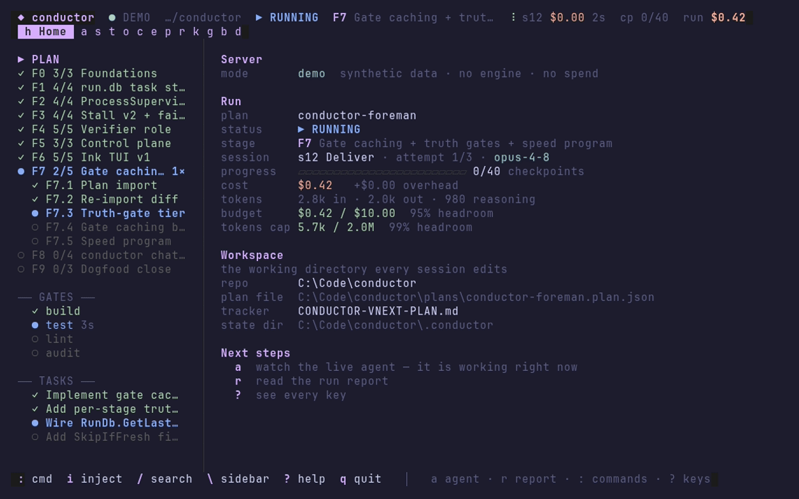

# Conductor

[](https://github.com/shaahink/conductor/actions/workflows/ci.yml)
[](LICENSE)
[](https://dotnet.microsoft.com/)
[](https://go.dev/)
[](https://payesh.vercel.app)

An engineering tool that turns a **plan** into verified, committed work. It drives coding agents one
session at a time, re-runs your gate battery itself after every session, and never takes an agent's
word for what got done — which is what makes it safe to leave running, watched from the laptop or
your phone.



<sub>Seven screens of the Face, recorded live from `conductor-face --demo` — a real terminal session
against synthetic data, no engine and no credentials.</sub>

It mechanises the session cycle you already run by hand:

```
pick next stage from the tracker
  → spawn a fresh headless agent session  [deliver | fix | resume | audit]
  → watchdog it (stall / timeout / budget detection)
  → when it exits, VERIFY INDEPENDENTLY: gate battery (real exit codes),
    new git commits, tracker checkpoint diff
  → record, report, commit+push REPORT.md, decide what runs next
  → repeat until every checkpoint is DONE and the gates confirm it
```

The plan docs stay the authority — Conductor never re-plans your work. It only enforces the rituals
(pre/post-session, QA-previous-session, evidence-or-it-didn't-happen) and keeps the loop moving
without you.

## The field guide

**[Payesh](https://payesh.vercel.app)** (*پایش*, Persian for **monitoring**) is Conductor's
companion site: a field guide to agentic engineering. Ten concepts the market is hiring for —
orchestration, context engineering, token economics, evals and gates, independent verification —
each explained in plain language, then shown working in Conductor's real runs, with what it cost.
Every figure on it is recomputed from the run store rather than typed in, the failed runs are
published beside the good ones, and the site was itself built by Conductor driving its repository
unattended.

## Try it

**Watch it** — the GIF above. Nothing to install.

**Run it, free** — one command, no credentials, no spend. It drives a complete plan end to end
against a built-in fake agent in a throwaway directory:

```
conductor demo
```

`conductor demo --from <file>` drives *your* board instead of the built-in one — a spec-kit
`tasks.md`, a Task-Master `tasks.json`, a plain markdown checklist — converted with no model call, so
"will it drive mine?" is answered before you point it at a real agent.

**Type its name** — `conductor` with no arguments is the **hub**, not a wall of help text: the runs
answering on this machine, the ones the catalogue remembers, the plans discoverable from where you
are standing, and four things to do about any of it — attach, start, `plan new`, `history`.

```
conductor
```

Redirected output (`conductor > board.txt`) prints the same board and exits 0 — no picker, no
prompt, nothing for a script to hang on.

**Drive a real plan** — in any repo, with an agent CLI you have already authenticated:

```
conductor init          # scaffold a plan + tracker, gates detected from the repo type
conductor doctor        # <2s health check — says exactly what's missing
conductor preflight     # the whole launch drill, one verdict: doctor, journey, the composed
                        # prompt, engine-versus-release, stale build, handoff escalation check
conductor run --once    # run ONE session and stop (the right first supervised run)
conductor run           # run the whole plan; Ctrl+C is always safe
```

`conductor init` also takes an idea instead of a blank plan:

```
conductor init --from-idea "port the ingest pipeline off the legacy scheduler"
```

## Install

Download a release binary for your platform, or build from source:

```bash
# macOS / Linux
./tools/install.sh
```
```powershell
# Windows
powershell -File tools\install.ps1
```

Either one publishes the engine, builds the Go Face next to it, and puts a global `conductor` on
your PATH. Re-run it to update. Building from source needs the prerequisites below; a release binary
needs none of them.

### Requirements

| | Version | Why |
|---|---|---|
| **.NET SDK** | 10.0 | The engine (`conductor`). `dotnet --version` must report `10.*`. |
| **Go** | 1.26 | The Face, a single ~22 MB Bubble Tea binary with no runtime dependency. |
| **Git** | any modern | Conductor verifies work by diffing commits; a run without git has no independent evidence. |
| **An agent CLI** | — | `claude` or `opencode` on PATH, already authenticated. This is what actually writes code. Not needed for `conductor demo`. |

Optional: a Telegram bot token (`CONDUCTOR_TELEGRAM_TOKEN`) for phone control; `ffmpeg` only to
regenerate the demo GIF.

### Platforms

The engine and the Face run anywhere .NET 10 and Go run — **PowerShell is not required to use
Conductor**. `conductor init` writes gates with no shell pinned, so a scaffolded plan is portable as
written.

Two safety rails *are* Windows-only: graceful stop on window close, and pid-identity checks that stop
Conductor killing a recycled pid. They are what makes a run survive unattended on a desktop that
might get closed; without them the kill is best-effort and everything else works. This repo's own
contributor tooling (the ratchet gate, the rehearsal) is also PowerShell, which is why CI runs its
full battery on `windows-latest` and a compile + Go-test check on Ubuntu.

Full detail, including what is and isn't proven: [`docs/platforms.md`](docs/platforms.md).

## The dashboard

`conductor run` is **one process tree**: engine + a localhost HTTP/SSE control plane, and it spawns
the Face automatically. You never launch the Go binary yourself; if it dies the run continues, and
`conductor face` attaches a fresh one.

Ten tabs: Home · Agent · History · Procs · Templates · Plan · Report · Knowledge · Telegram ·
Kanban — each one keypress away on `1`–`9`/`0` — plus an always-visible plan sidebar and a `:`
command palette for every control verb, destructive ones confirming first. Home is the landing page
it opens on; History is the old Sessions and Timeline as a single surface; the old Console is Agent's
raw-stream mode. The live keybinding and layout reference is
[`face-go/STYLE.md`](face-go/STYLE.md).

Nothing is truncated with no way back: every long surface owns a scrolling pane, and `enter` on any
clipped cell or row opens the **reader** — a full-screen overlay with soft wrap, pager keys and a
percent readout, so a 2000-line report and a 300-character kanban note are both readable in place.

```
conductor run --headless     # no Face — plain line output (CI / redirected output)
conductor run --no-face      # control plane runs, but nothing is spawned to view it
conductor face               # attach another Face to an already-running conductor
conductor face --pick        # the run picker: everything on this machine, live and past
conductor face --archive <run>   # open a FINISHED run read-only — no engine, no write token
```

## Why it can be left alone

**Agents' claims are never trusted.** After every session Conductor re-runs the gate battery itself
and diffs the tracker + git log. A checkpoint counts only when the row flipped to DONE **and**
commits exist **and** gates are green. An agent may *claim* a checkpoint; only the engine *confirms*
one.

**"All DONE" is confirmed, not believed.** When the tracker says the plan is complete, Conductor runs
the full battery one more time before declaring victory.

**Failures loop back with evidence.** Red gates mean the next session is a *fix session* whose prompt
embeds the actual failing gate output.

**Everything is resumable.** State persists to `run.db` on every transition. Kill it, reboot, Ctrl+C
— `conductor run` picks up where it left off.

**It knows what it cost.** `conductor money` prices a run or a whole project from its own ledger:
sessions, tokens, cache-read share, dollars, and what one checkpoint cost. `conductor budget` reads
the same catalogue and prescribes the next run's session ceiling *and* the wrap-up nudge — measured
from the sessions this repo actually ran, not guessed. `conductor spend` answers the question one
level up: what this whole **machine** spent today, this week and this month, across every store it
knows, with each real run counted once.

### What it does when a session ends

| Observation | Outcome | Next |
|---|---|---|
| gates green + new commits + ≥1 checkpoint newly DONE | `Advanced` | next checkpoint/stage, attempts reset |
| gates green + new commits, nothing flipped | `Progress` | another deliver session |
| gates green, no commits | `NoProgress` | fix session, attempt burned |
| any required gate red | `GatesRed` | fix session with gate output embedded |
| no output for `stallMinutes` | `Stalled` | killed, then resume same session (≤ maxResumes) |
| over `sessionTimeoutMinutes` | `TimedOut` | same as stalled |
| a verifier session returned no parseable score | `AgentError` | fix session, attempt burned |
| backend rejected the credential (401 / expired OAuth) | `AuthFailed` | **NeedsHuman** at once, with a re-auth hint — no gate battery, no backoff, no retry |
| backend says usage/rate limit | `LimitBackoff` | wait `backoffMinutes`, resume — no attempt burned |
| session exceeded token budget | `RolledOver` | clean handoff, fresh session — no attempt burned |
| session called `task --blocked-until <instant>` | `BlockedUntil` | loop sleeps to that instant, then spawns exactly one more session — no attempt burned |
| handoff contains `HUMAN:` or a row flips to BLOCKED | — | **NeedsHuman**: loop parks, report + notification |
| 2× consecutive zero-output stall | — | **NeedsHuman** (identical-stall detection) |

Attempt budget per stage = `stage.sessions × limits.stageSlackFactor`. When exhausted, an **advisor**
(a cheap second model) chooses retry / resume / skip / human — validated against a fixed vocabulary,
never freeform. The loop itself stays deterministic; no model sits in the scheduling path.

## While you're away

After every session Conductor rewrites `.conductor/REPORT.md` in the target repo and commits + pushes
it. Open it on GitHub from your phone: status, per-stage progress, session history, gate results,
timeline, health.

Optional **Telegram** integration adds push notifications and two-way control (`/status`, `/tasks`,
`/pause`, `/resume`, `/approve`, `/skip`) via inline keyboard. **Webhooks** (generic HTTP POST,
Discord, Slack) fire on NeedsHuman and completion.

`conductor github sync --backfill <run>` mirrors a run's board into GitHub issues — one issue per
checkpoint with status labels and the stage as a milestone, plus a run issue with a comment per
session. It is **one way out and off by default**: conductor pushes, and never reads GitHub state
back into the run. Drag a card there and the run does not notice; the tracker stays the contract.

## Design decisions

- **The tracker is the progress database.** No parallel bookkeeping to drift.
- **Sessions are processes, not threads.** A hung agent can always be killed as a tree; a killed
  conductor can always resume the agent by session id.
- **Event-sourced backbone.** `events.jsonl` is the append-only truth. Enables replay, timeline,
  health metrics, task graph.
- **Deterministic first, model second.** The advisor is consulted only at genuine dead-ends, and its
  answer is validated against a vocabulary of actions.
- **Provider abstraction.** `IAgentProvider` separates the engine from backend wire formats
  (opencode, claude, text).
- **Parallel lanes.** Read-only analysis lanes (scratch dir) and isolated worktree lanes (git
  worktree + merge gate) run concurrently with the primary session.
- **Battery collapse.** Opt in to skip the agent's redundant pre-session ritual, saving 30-50% of
  output tokens.

## Documentation

[`docs/README.md`](docs/README.md) is the index. The short path:

- [`docs/quickstart.md`](docs/quickstart.md) — plan → tracker → dry run → first supervised session
- [`docs/cli.md`](docs/cli.md) — the verbs, and how to override the defaults
- [`docs/plan-config.md`](docs/plan-config.md) — the complete plan schema
- [`docs/operating.md`](docs/operating.md) — every control verb and when to reach for it
- [`docs/troubleshooting.md`](docs/troubleshooting.md) — when a run looks stuck, dead, or wrong
- [`docs/platforms.md`](docs/platforms.md) — Windows / Linux / macOS support
- [payesh.vercel.app](https://payesh.vercel.app) — the field guide: the concepts behind the design,
  argued from this tool's own measured runs

Contributors: [`CONTRIBUTING.md`](CONTRIBUTING.md) and [`docs/dev/`](docs/dev/). Closed eras and their
gate transcripts: [`docs/history/`](docs/history/).

> Conductor drives itself. [`plans/karvansara/CORE-TRACKER.md`](plans/karvansara/CORE-TRACKER.md) is
> the **live tracker** for the era in flight — the same checkpoint-table format described in
> [`docs/tracker.md`](docs/tracker.md), being used on this repo by the tool in this repo. Each closed
> era's tracker is kept beside its gate transcripts in
> [`docs/history/archive/trackers/`](docs/history/archive/trackers/); every one of them is the
> `tracker` path some [`plans/`](plans/) plan file pointed at while its era was in flight.

## Testing without spending anything

No test in this repo requires an API key.

```
conductor demo                                   # cross-platform, seconds, a full run
powershell -File tools/w5/rehearsal.ps1 -Keep    # Windows, ~40s, 33 checks over the live control plane
```

The rehearsal write-up, including the three engine defects it found, is
[`docs/dev/workgraph/W5-REHEARSAL.md`](docs/dev/workgraph/W5-REHEARSAL.md).

## Contributing

See [CONTRIBUTING.md](CONTRIBUTING.md) — the short version is that the gate battery is the review, and
the ratchet means a PR may not make the bar smaller. Security reports: [SECURITY.md](SECURITY.md).

## License

[MIT](LICENSE). Use it, modify it, ship it — commercially or not.
